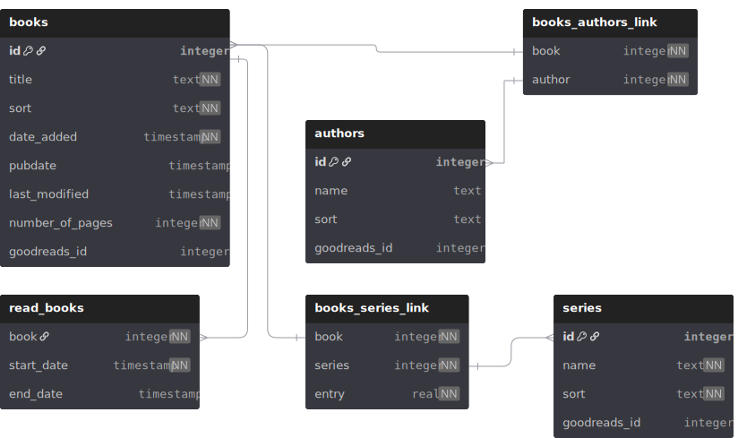

# IronScribe

A server-client application for ebook syncing and management written in Rust

## Goals

- [ ] Create different components
  - [ ] Folder sync
  - [ ] Client/Web GUI
    - [ ] Add/Edit/Remove books
    - [ ] SQL database
    - [ ] Book metadata
  - [ ] Analytics

## Technical Planning

Initially, the plan was to implement some sort of sync for keeping the library shared between devices, most likely using gRPC with the tonic crate. But this turned out much harder than anticipated, and so for now, this endeavor has been postponed indefinitely.

Instead, I focus on the necessary features to have a suitable replacement for calibre and calibre-web. The current tech stack looks as follows:

- GUI with dioxus (fullstack)
- database with SQLite using the rusqlite crate

### Database

This is the current plan for the database schema (written based on Calibre's metadata SQLite file):

Since I'm not planning on porting all Calibre features, I'm also leaving out quite a few tables in the SQL database.

Since I'm taking heavy inspiration from both calibre and calibre-web, I'll also handle metadata with some sort of relational database. I'm still deciding between something lightweight and local like SQLite, just like calibre uses, or something more "high-end" like postgreSQL, which I'm already familiar with.

## Roadmap to Replacing Calbire and Calibre-Web (For Myself)

- [ ] Database with metadata for books
- [ ] Auto-import folder
- [ ] Library view
  - [ ] Table view
  - [ ] Thumbnail view
- [ ] Tracking view
- [ ] Auto-fetch Goodreads ID
- [ ] Fetch page count via Goodreads ID
- [ ] Edit text in ebooks

## Planned Improvements Over Calibre

Calibre has been mentioned several times above, and it's an absolutely great program. It provides a huge variety of tools for editing both ebooks and their metadata, and overall managing a virtual library. But there are a few short-comings in my opinion that I'd like to improve on here:

### Support for Multiple Series

While this is not too common, I have quite a few books in my library that kind of belong to multiple series, be that because there are different orders in which a series can be read (chronological vs. publication date) or because there are multiple smaller series belonging to an overarching universe (e.g., Brandon Sanderson's Cosmere consists of multiple series, but they also all belong to the Cosmere as a whole).

### Integration With Kobo Sync

This is a very nebulous task. The idea came because calibre-web already has this feature available, so I thought it's definitely doable (although whether it's also doable by me remains to be seen). And I currently don't own a Kobo device, but it seems like one of the best devices when it comes to being independent of a platform, e.g., when compared to Amazon Kindle devices and similar.

### Direct Integration with Web, Desktop and Mobile

This is kind of a stretch that is not quite as important to me as the other improvements. I just like having the same data available from multiple places, simply because I don't like having to use a specific device to access something like this. When I need to do something with my library, I want to do that with whatever device is accessible. This doesn't necessarily mean that I want to have all features on all platforms, but since this is a very open and broad goal, I'll just leave it at that.

### Some Sort of Logging

Calibre supports adding custom columns to mark books as read, and probably other things along those lines as well. While that's nice to have, it doesn't really satisfy my need for numbers and statistics. I want my library tool to let me analyze my reading habits over time, see how many books I've read per author, visualize how my reading speed changes based on the genre I'm reading. And I want all of those things in a way that is kind of "automated", in the sense that, I could theoretically look this data up either manually in Calibre or by analyzing its metadata with some data analysis Python scripts. But I want to have something of a dashboard-like access to these kinds of numbers.

### More Automated Actions

Ideally, I'd like to have the option of completely customizing what happens e.g., when a book is added to the library. I'm thinking about making it as general as allowing the user to create rules that consist of some sort of trigger and some action that will be performed when the trigger occurs.

### Multi-User Support

Calibre-web doesn't offer multi-user support, at least not for all features. Sure, you can create multiple users, and I think most aspects of the tool are then on a per-user basis, but basic stuff like books marked as read don't fall into that category.

### Other Minor Short-Comings of Calibre-Web

I hate hate *HATE* the fact that you have to manually reconnect calibre-web to the database file whenever you changed something. Is it really that big of a deal to let the service just check the database file every 30s for changes? Or have some file watchdog notify calibre-web when the metadata file changed? Also, why make it possible to mark books as read in the web UI but not in a way that is compatible with the underlying calibre database? Also, maybe add author pages that are customizable, at least with pictures and maybe a short biography. This one is a bonus though.

## Possible Additions

### Integrated Sync

Because this project aims to also be a replacement for my personal use of calibre-web, a big part of it is creating a working application to also handle syncing the library between multiple devices. The current approach is to have a client-server architecture with one server and several clients. Inspiration would be taken from [FZambia's dirsync](https://github.com/FZambia/dirsync), which would have to be adapted to support a single-server-multiple-client setup and also a bidirectional sync.

### Audiobooks

In the past, I've sometimes "consumed" a book by reading parts when possible and listening to others when I was doing something like driving, cooking or folding laundry. At some point I also started self-hosting audiobooks with audiobookshelf, which has the fantastic feature of allowing you to have a library that can contain books *and* audiobooks, and it nicely displays this when both media are available for a book. Its chapter progress also made me think that it has to be possible to somehow keep a rough sync between both media, for example by at least tracking which chapter has been finished on either media and then updating the progress on both.

### More Stolen Features

Audiobookshelf also has several other features I really like, such as a series overview, an author overview, the option to replace images for authors and books directly in the GUI by either picking a different cover from given sources or supplying a link to some image. This is miles better than the calibre feature where you have to select sources, fetch metadata and then review the fetched covers, especially when you want to have matching covers for a series.
